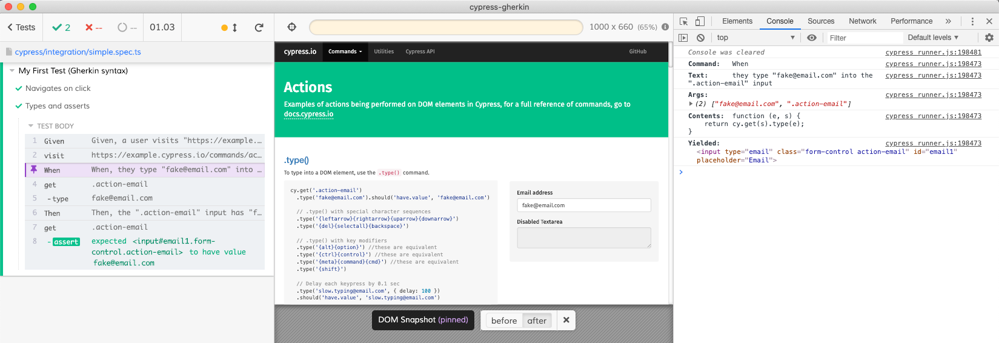

# cypress-gherkin

Gherkin syntax in Cypress

## Overview

Enable a Gherkin-like syntax for tests in Cypress.io.

## Installation

```bash
npm i --save-dev @hypercubed/cypress-gherkin
```

## Usage

`cypress-gherkin` is not a preprocessor and, therefore, doesn't support cucumber feature and step definition files (see [Credits and alternatives](#Credits-and-alternatives) if that is what you want).  Instead `cypress-gherkin` is designed to work with and alongside existing Cypress tests.

By way of example let's start with a simple existing cypress test:

```ts
describe('My First Test', () => {
  it('Navigates on click', () => {
    cy.visit('https://example.cypress.io');
    cy.contains('type').click();
    cy.url().should('include', '/commands/actions')
  });

  it('Types and asserts', () => {
    cy.visit('https://example.cypress.io/commands/actions');
    cy.get('.action-email').type('fake@email.com');
    cy.get('.action-email').should('have.value', 'fake@email.com');
  });
});
```

We can import `feature` and `scenario` from `cypress-gherkin`.  `feature` and `scenario` are aliases for `describe` and `it` respectively.

```ts
import { feature, scenario } from '@hypercubed/cypress-gherkin';

feature('My First Test', () => {
  scenario('Navigates on click', () => {
    cy.visit('https://example.cypress.io');
    cy.contains('type').click();
    cy.url().should('include', '/commands/actions')
  });

  scenario('Types and asserts', () => {
    cy.visit('https://example.cypress.io/commands/actions');
    cy.get('.action-email').type('fake@email.com');
    cy.get('.action-email').should('have.value', 'fake@email.com');
  });
});
```

To use Gherkin syntax we need to add `Given`, `When`, `Then` step definitions and replace the test sequences with matching `given`, `when`, `then` steps.  See [Gherkin Reference](https://cucumber.io/docs/gherkin/reference/) for more information on the Gherkin syntax itself.

```ts
import { feature, scenario, Given, When, Then, given, when, then } from '@hypercubed/cypress-gherkin';

Given('a user visits {string}', (s: string) => {
  return cy.visit(s);
});

When('they click the link labeled {string}', (s: string) => {
  return cy.get('a').contains(s).click();
});

When('they type {string} into the {string} input', (e: string, s: string) => {
  return cy.get(s).type(e);
});

Then('the URL should include {string}', (s: string) => {
  return cy.url().should('include', s);
});

Then('the {string} input has {string} as its value', (e: string, s: string) => {
  return cy.get(e).should('have.value', s);
});

feature('My First Test', () => {
  scenario('Navigates on click', () => {
    given('a user visits "https://example.cypress.io"');
    when('they click the link labeled "type"');
    then('the URL should include "/commands/actions"');
  });

  scenario('Types and asserts', () => {
    given('a user visits "https://example.cypress.io/commands/actions"');
    when('they type "fake@email.com" into the ".action-email" input');
    then('the ".action-email" input has "fake@email.com" as its value');
  });
});
```

This cypress test, now written in Gherkin syntax, will run similar to before.  In the [Cypress Test Runner](https://docs.cypress.io/guides/core-concepts/test-runner.html#Overview) you can see the Gherkin steps, snapshots and additional information:



Finally, as a bonus, you can use Gherkin text directly:

```ts
import { feature, scenario, Given, When, Then, gherkin } from '@hypercubed/cypress-gherkin';

Given('a user visits {string}', (s: string) => {
  return cy.visit(s);
});

When('they click the link labeled {string}', (s: string) => {
  return cy.get('a').contains(s).click();
});

When('they type {string} into the {string} input', (e: string, s: string) => {
  return cy.get(s).type(e);
});

Then('the URL should include {string}', (s: string) => {
  return cy.url().should('include', s);
});

Then('the {string} input has {string} as its value', (e: string, s: string) => {
  return cy.get(e).should('have.value', s);
});

gherkin(
  `
    Feature: My First Test
      Scenario: Navigates on click
        Given a user visits "https://example.cypress.io"
        When they click the link labeled "type"
        Then the URL should include '/commands/actions'

      Scenario: Types and asserts
        Given a user visits "https://example.cypress.io/commands/actions"
        When they type "fake@email.com" into the ".action-email" input
        Then the '.action-email' input has "fake@email.com" as its value
  `
);
```

However, using the Gherkin syntax allows mixing Gherkin syntax and cypress commands:

```ts
describe('Gherkin syntax mixed with Cypress', () => {
  before(( )=> {
    given('a user visits "https://example.cypress.io"')
  });

  scenario('Navigates on click', () => {
    cy.get('a').contains('type').click();
    then('the URL should include "/commands/actions"');
  });

  feature('a feature', () => {
    beforeEach(() => {
      given('a user visits "https://example.cypress.io/commands/actions"');
        and('they type "fake@email.com" into the ".action-email" input');
    });

    it('Types and asserts', () => {
      then('the ".action-email" input has "fake@email.com" as its value')
        .and('have.class', 'form-control');

      then('the ".action-email" input should:', ($e: any) => {
        expect($e).to.have.value("fake@email.com");
      });
    });
  });
});
```

## API Details

Many of the gherkin syntax methods are aliases of Mocha’s bdd syntax:

| Gherkin Keyword  | Gherkin-syntax    | Mocha        |
| ---------------- | ----------------- | ------------ |
| Feature          | `feature`         | `describe`   |
| Rule             | `rule`            | `describe`   |
| Scenario Outline | `scenarioOutline` | `describe`   |
| Rule             | `rule`            | `describe`   |
| Background       | `background`      | `beforeEach` |
| Scenario         | `scenario`        | `it`         |

### Step Definitions

Step definitions (`Given`, `When`, `Then`) define the steps taken in each gherkin-step (`given`, `when` and `then`, `and`, `but`).  In step definitions you can use Regular Expressions or [Cucumber Expressions](https://cucumber.io/docs/cucumber/cucumber-expressions/).

For example, to use the Gherkin step:

```
Given a user visits {string}
```

first define a step definition:

```ts
import { Given } from '@hypercubed/cypress-gherkin';

Given('a user visits {string}', (s: string) => {
  return cy.visit(s);
});
```

which is invoked with the following gherkin-step:

```ts
given('a user visits "https://example.cypress.io"');
```

### Scenario Outline

As described above `scenario` is simply an alias for `it`.  However, `scenarioOutline` is an alias for `describe`.  Within an `scenarioOutline` you cna define a "Scenario Template" and one more more examples using the `outline` and `examples` syntax methods (respectively).

For example, one my translate the following Gherkin text:

```feature
Feature: Example Tables

  Scenario Outline: eating cucumbers
    Given there are <start> cucumbers
    When I eat <eat> cucumbers
    Then I should have <left> cucumbers

    Examples: These are passing
      | start | eat | left |
      |    12 |   5 |    7 |
      |    20 |   5 |   15 |

    Examples: These are also passing
      | start | eat | left |
      |    22 |   5 |   17 |
      |    10 |   5 |    5 |
```

to the gherkin-syntax:

```ts
feature('Examples Tables in Gherkin syntax', () => {
  scenarioOutline(`eating cucumbers`, () => {
    outline(() => {
      given('there are <start> cucumbers');
      when('I eat <eat> cucumbers');
      then('I should have <left> cucumbers');
    });

    examples('These are passing', [
      ['start', 'eat', 'left'],
      [12,       5,    7],
      [20,       5,    15]
    ]);

    examples('These are also passing', [
      ['start', 'eat', 'left'],
      [12,       5,    7],
      [20,       5,    15]
    ]);      
  });
});
```

which is functionally equivalent to:

```ts
feature('Examples Tables in Gherkin text', () => {
  describe('eating cucumbers', () => {
    describe('These are passing', () => {
      scenario('example #1', () => {
        given('there are 12 cucumbers');
        when('I eat 5 cucumbers');
        then('I should have 7 cucumbers');
      });
      
      scenario('example #2', () => {
        given('there are 20 cucumbers');
        when('I eat 5 cucumbers');
        then('I should have 15 cucumbers');
      });
    });
    
    describe('These are also passing', () => {
      scenario('example #1', () => {
        given('there are 22 cucumbers');
        when('I eat 5 cucumbers');
        then('I should have 17 cucumbers');
      });
      
      scenario('example #2', () => {
        given('there are 10 cucumbers');
        when('I eat 5 cucumbers');
        then('I should have 5 cucumbers');
      });
    });
  });
});
```

## CLI

`gherkin-syntax` includes a simple CLI tool for converting feature files to gherkin syntax.  This CLI is invoked using UNIX-like pipelines.

For example:

```
cat my-feature.feature | node ./node_modules/.bin/cypress-gherkin
```

will output a TypeScript scaffold of the feature in gherkin-syntax.

Use the `>` operator to generate a file:

```
cat my-feature.feature | node ./node_modules/.bin/cypress-gherkin > my-feature.feature.ts
```

## Credits and alternatives

Based on and inspired by [cypress-cucumber-preprocessor](https://github.com/TheBrainFamily/cypress-cucumber-preprocessor) and [picklejs](https://www.picklejs.com/).  

## License

This project is licensed under the MIT License - see the LICENSE file for details

